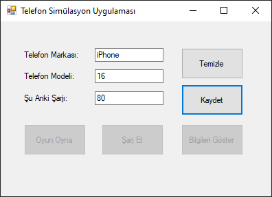
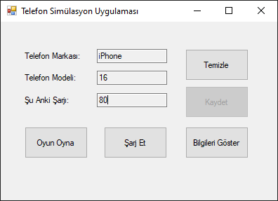
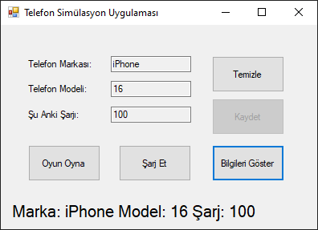
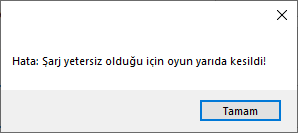
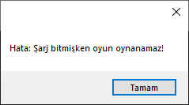

# C# Akıllı Telefon Simülasyonu (SmartPhone Simulation)


## 📋 Proje Hakkında

Bu proje, **Nesne Yönelimli Programlama (OOP)** prensipleri temel alınarak geliştirilmiş, interaktif bir **Windows Forms** uygulamasıdır. Yazılım, sanal bir akıllı telefonun yaşam döngüsünü (şarj yönetimi, aktivite tüketimi ve durum takibi) simüle eder.

Kullanıcı etkileşimlerine dayalı olay güdümlü (event-driven) bir mimariye sahip olan uygulama, dinamik durum yönetimi ve istisna işleme (exception handling) mekanizmalarıyla hataları profesyonelce yönetir.

---

## 🚀 Temel Özellikler

* **Dinamik Nesne Yönetimi:** Kullanıcı girdilerine göre çalışma zamanında (runtime) `Telefon` nesnesi oluşturulması.
* **Enerji Yönetim Modülü:** Şarj seviyesinin mantıksal sınırlar (0-100) içerisinde tutulmasını sağlayan algoritma.
* **Aktivite Simülasyonu:** "Oyun Oyna" fonksiyonu ile batarya tüketimi ve kritik seviye kontrolü.
* **Hata ve İstisna Denetimi:** Yetersiz enerji durumlarında kullanıcıyı bilgilendiren ve işlemi kesen `try-catch` mekanizması.
* **Kullanıcı Dostu Arayüz (UI):** Anlık durum güncellemeleri ve veri giriş validasyonları.

---

## 📸 Ekran Görüntüleri ve Kullanım Senaryoları

### 1. Başlangıç ve Veri Girişi
Kullanıcı, simüle edilecek cihazın marka, model ve başlangıç şarj değerlerini sisteme girer.



### 2. Nesne Başlatma ve Aktivasyon
"Kaydet" işlemi ile birlikte veriler valide edilir, `Telefon` sınıfı örneklendirilir ve kontrol paneli aktif hale gelir.



### 3. Durum İzleme
Cihazın anlık parametreleri (Marka, Model, Şarj Durumu) arayüz üzerinden gerçek zamanlı olarak takip edilebilir.



### 4. İstisna Yönetimi (Exception Handling)
Sistem, batarya seviyesi oyun oynamak için kritik seviyenin (20 birim) altındaysa işlemi yarıda keser veya batarya tamamen bittiyse eylemi engeller.

| Düşük Pil Uyarısı | Batarya Bitti Hatası |
| :---: | :---: |
|  |  |

---

## 🛠 Teknik Mimari

Proje, iş mantığı (Business Logic) ve arayüz (UI) katmanlarını birbirinden ayıran modüler bir yapıya sahiptir.

### `Telefon.cs` Sınıf Yapısı
Sistemin çekirdeğini oluşturan bu sınıf, kapsülleme (encapsulation) ve mantıksal kontrolleri barındırır.

```csharp
public void OyunOyna() 
{
    if (this.tel_sarj >= 20)
    {
        this.tel_sarj -= 20; // Başarılı İşlem
    }
    else
    {
        // Kritik Seviye Kontrolü ve Hata Fırlatma
        throw new Exception("Hata: Şarj yetersiz...");
    }
}
